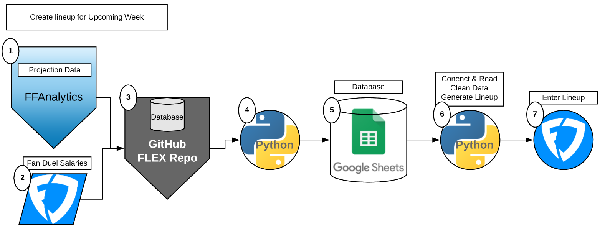

**Table of Contents**

- [Mission Statement](#mission-statement)
- [Methodology](#methodology)
  * [Platform Projection Example](#platform-projection-example)
  * [Standard Deviation List Example](#standard-deviation-list-example)
  * [Why is this useful?](#why-is-this-useful?)
- [Lineup Generation](#lineup-generation)
- [High Level Tasks](#high-level-tasks)

Mission Statement
==================
To openly share daily fantasy football generated lineups that result in victory atleast 51% of the time.

Methodology
=====================
Using top Fantasy Football projection predicting platforms (nfl.com, cbssports.com, fftoday.com) we will assign each player
a standard deviation value each week.

This value is determined by taking the three projections and finding the [standard deviation](https://www.mathsisfun.com/data/standard-deviation.html) of the 3 numbers.
#### Platform Projection Example

| Platform  | Player | Projections |
| :---:         |     :---:      |          :---: |
| NFL   | Derrick Henry     | 18  |
| CBS    | Derrick Henry       | 15   |
| FFToday    | Derrick Henry       | 22   |
| NFL   | Duke Johnson     | 10  |
| CBS    | Duke Johnson       | 13   |
| FFToday    | Duke Johnson       | 12   |

#### Standard Deviation List Example
| Player | Standard Deviation |
|     :---:      |          :---: |
| Derrick Henry     |  2.867   |
| Duke Johnson     |  1.247   |

We then generate a list of all the players for the upcoming week according to this model.
Once we have our list where each player has a standard deviation value assigned to them we can generate our daily fantasy lineup.

### Why is this useful?
By assigning each player a standard deviation value we can now pose the question..

**Which standard deviation value yields the highest points scored?**

In order to answer this question we first need to collect data.. which we have.

[FLEX/flex/Revised_data/ffa_proj](https://github.com/terror12/FLEX/tree/master/flex/Revised_Data/ffa_proj)

We will take these standard deviation values assigned to each play and pair them with the actual points each player scored
for every week over the past 5 years.

What this will give us is the performance of a player grouped by the standard deviation that was assigned to them.

Our goal will be to then generate a lineup for the upcoming week based on players that have our desired standard deviation value.
We can easily do this since the standard deviation value is being calculated based on incoming projections that are released
days before the game.

Lineup Generation
======================

With this list and the code in place to generate valid lineups based on the players standard deviation value, we will use a database of previous years actual results to evaluate the success of a lineup. Overtime the optimal STD value for each postion in a lineup will reveal itself.

Using Fanduels salary system compared with the average of the other top Fantasy prediction engines(NFL.com, Yahoo, ESPN) 
we can construct a standard deviation (STD) value for every player for the upcoming week. With this list and the code in place to generate valid lineups based on the players standard deviation value, we will use a database of previous years actual results to evaluate the success of a lineup. Overtime the optimal STD value for each postion in a lineup will reveal itself. 

We will use a program to generate lineups along with a community driven approach to increase the number of different STD combinations that we can record. This will be accomplished by providing a website for users to control sliders and generate their own lineups, which will be recorded and combined with all other previous runs in the database.

Historical Analyses
======================

Tickets will be tracked and assigned on the following Trello board
https://trello.com/b/k1UY8kRD/flex-project
======================

High Level Tasks
======================
 1. Collect database of historical data as far back as possible (5 years currently)
    a. Using Google Sheets as the database, making API calls to Google Sheets to work with the Data.
 2. Write python script/library to scrape webpages to pull down current projections week to week while in season. Save files as XMLs or CSVs
 3. Depending how files are stored import into Google sheets and automate how to create the STD list
 4. Build webpage that allows you to generate lineups for that weeks players.
    a. Include sliders to change the STD number that you assign for the code to pull players from
    b. Store all generated lineups and evaluate based on post week results save only lineup configuration that yeild a high result.
 5. Send link to community and advertise that using this can help them win $$$
 6. Create Facebook, Instagram, and twitter for Flexproject

[1] https://www.mathsisfun.com/data/standard-deviation.html
[2]