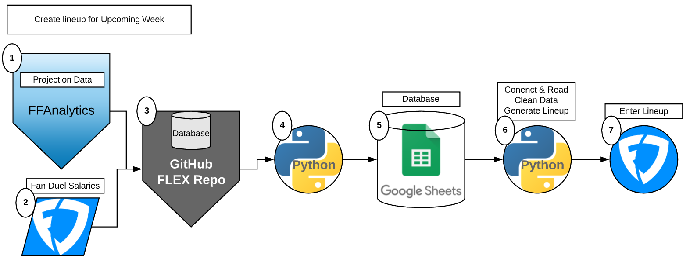

**Table of Contents**

- [Mission Statement](#mission-statement)
- [Methodology](#methodology)
  * [Platform Projection Example](#platform-projection-example)
  * [Standard Deviation List Example](#standard-deviation-list-example)
  * [Why is this useful?](#why-is-this-useful?)
- [Historical Analyses](#historical-analyses)
- [Lineup Generation](#lineup-generation)
  * [Steps](#steps)
- [Task Management](#task-management)
- [High Level Tasks](#high-level-tasks)

Mission Statement
==================
To openly share daily fantasy football generated lineups that result in victory atleast 51% of the time.

Methodology
=====================
Using top Fantasy Football projection predicting platforms (nfl.com, cbssports.com, fftoday.com) we will assign each player
a standard deviation value each week.

This value is determined by taking the three projections and finding the [standard deviation](https://www.mathsisfun.com/data/standard-deviation.html) of the 3 numbers.
#### Platform Projection Example

| Platform  | Player | Projections |
| :---:         |     :---:      |          :---: |
| NFL   | Derrick Henry     | 18  |
| CBS    | Derrick Henry       | 15   |
| FFToday    | Derrick Henry       | 22   |
| NFL   | Duke Johnson     | 10  |
| CBS    | Duke Johnson       | 13   |
| FFToday    | Duke Johnson       | 12   |

#### Standard Deviation List Example
| Player | Standard Deviation |
|     :---:      |          :---: |
| Derrick Henry     |  2.867   |
| Duke Johnson     |  1.247   |

We then generate a list of all the players for the upcoming week according to this model.
Once we have our list where each player has a standard deviation value assigned to them we can generate our daily fantasy lineup.

### Why is this useful?
By assigning each player a standard deviation value we can now pose the question..

**Which standard deviation value yields the highest points scored?**

In order to answer this question we first need to collect data.. which we have.

[FLEX/flex/Revised_data/ffa_proj](https://github.com/terror12/FLEX/tree/master/flex/Revised_Data/ffa_proj)

We will take these standard deviation values, that are assigned to each player, and pair them with the actual points each player scored
for every week over the past 5 years.

This allows us to analyze which standard deviation is the best over time in numerous different ways.
With this list and the code in place to generate valid lineups based on the players standard deviation value and FanDuel salary,
overtime the optimal standard deviation value for each position in a lineup will reveal itself.

Our goal will be to then generate a lineup for the upcoming week based on players that have our desired standard deviation value.
We can easily do this since the standard deviation value is being calculated based on incoming projections that are released
days before the game.

Historical Analyses
======================
#### TODO Update with detailed explanation or link to report of data analsis.

Lineup Generation
======================

| Step | Description                    |
| ------------- | ------------------------------ |
| **1**      | All projection data will be downloaded from the following web application[FFAnalytics Projections](https://github.com/terror12/FLEX/tree/master/flex/Revised_Data/ffa_proj)       |
| **2**   | placeholder for Fanduel affiliate link...     |
| **3**   | We then store that weeks projections and FanDuel player and salary data in the FLEX github repo.[FLEX/flex/Revised_data/ffa_proj](https://github.com/terror12/FLEX/tree/master/flex/Revised_Data/ffa_proj)     |
| **4&5**   | Then we will use Python with the Google Sheets API to ensure the projection data corresponds to the appropriate FanDuel player data. We rely on the following tests to accomplish this. [FLEX/flex/tests/tier-0/test_sheets_prereq](https://github.com/terror12/FLEX/tree/master/flex/tests/tier-0/test_sheets_prereq) (Each week will be its own sheet.) #TODO Figure out how to make Google Sheets available to public in view only and available through the api for fellow developers.    |
| **6**   | Then we use Python to read the data from the Google Sheet and use it to drive our build lineup tests. [FLEX/flex/tests/tier-0/test_sheets_prereq](https://github.com/terror12/FLEX/tree/master/flex/tests/tier-1/test_lineup_gen |
| **7**   | The output of step 6 will be a valid Fanduel lineup that can now be manually entered into the app or web for the proper NFL contest. #TODO Make output into .csv file for easier consumption.   |

Using a community driven approach to increase the number of different standard deviation combinations that we can record.
This will be accomplished by providing a website for users to control sliders and generate their own lineups,
which will be recorded and combined with all other previous runs in the database.

Task Management
======================
Tickets will be tracked and assigned on the following Trello board
https://trello.com/b/k1UY8kRD/flex-project

High Level Tasks
======================
 1. Collect database of historical data as far back as possible (5 years currently)
    a. Using Google Sheets as the database, making API calls to Google Sheets to work with the Data.
 2. Write python script/library to scrape webpages to pull down current projections week to week while in season. Save files as XMLs or CSVs
 3. Depending how files are stored import into Google sheets and automate how to create the STD list
 4. Build webpage that allows you to generate lineups for that weeks players.
    a. Include sliders to change the STD number that you assign for the code to pull players from
    b. Store all generated lineups and evaluate based on post week results save only lineup configuration that yeild a high result.
 5. Send link to community and advertise that using this can help them win $$$
 6. Create Facebook, Instagram, and twitter for Flexproject